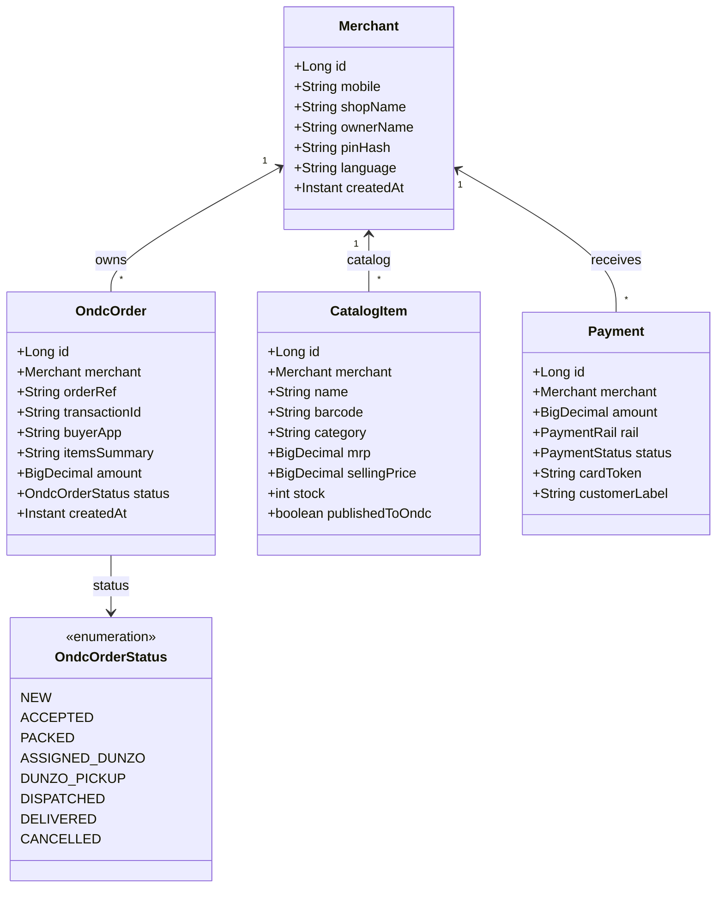
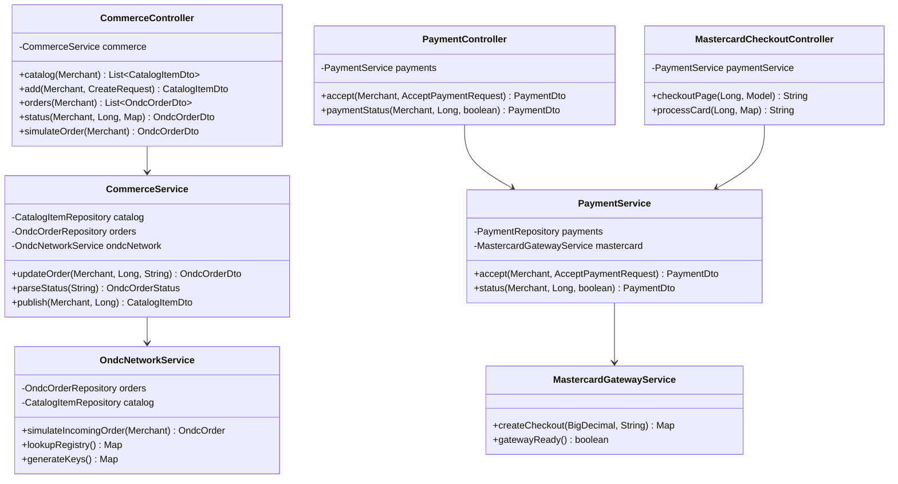
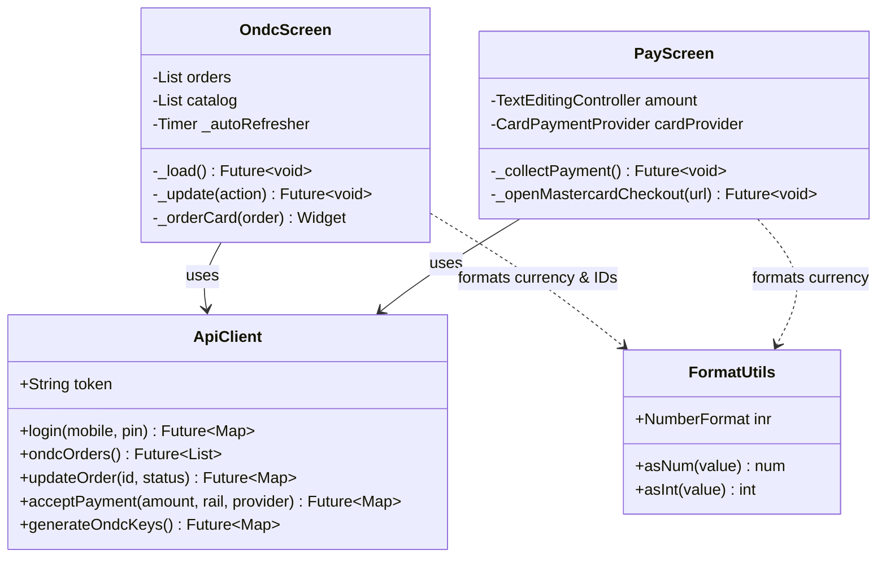

# FinTap Code Architecture & UML Class Flow Specification

This document provides a detailed software design specification of the **Code Architecture & Class Flow** for the **FinTap** platform. It documents the class relationships, domain models, Spring Boot service beans, JPA repository interfaces, DTO records, and Flutter UI/Client classes.

---

## 1. Class Structure Overview



---

## 2. Spring Boot Core Service & Controller Architecture



---

## 3. Data Access & Repository Interfaces

The persistence layer uses Spring Data JPA interfaces extending `JpaRepository`:

```java
public interface OndcOrderRepository extends JpaRepository<OndcOrder, Long> {
    List<OndcOrder> findByMerchantOrderByCreatedAtDesc(Merchant merchant);
    Optional<OndcOrder> findByOrderRef(String orderRef);
    Optional<OndcOrder> findByTransactionId(String transactionId);
}

public interface CatalogItemRepository extends JpaRepository<CatalogItem, Long> {
    List<CatalogItem> findByMerchantOrderByNameAsc(Merchant merchant);
    Optional<CatalogItem> findByMerchantAndBarcode(Merchant merchant, String barcode);
}

public interface PaymentRepository extends JpaRepository<Payment, Long> {
    List<Payment> findByMerchantOrderByCreatedAtDesc(Merchant merchant);
}
```

---

## 4. Frontend Flutter Class Structure

The mobile app employs a clean modular component structure:



---

## 5. Object Interaction & Execution Trace

When the user taps **"Dispatch with DUNZO"** in the Flutter app:

```
[OndcScreen UI]
   │
   ├─► calls api.updateOrder(orderId, 'DUNZO_PICKUP')
   │      │
   │      ▼
[ApiClient (Dart)]
   │
   ├─► HTTP POST /api/ondc/orders/{id}/status  {"status": "DUNZO_PICKUP"}
   │      │
   │      ▼
[AuthAdvice Interceptor (Java)]
   │
   ├─► Resolves Bearer token -> Merchant entity
   │      │
   │      ▼
[CommerceController.java]
   │
   ├─► status(merchant, id, body)
   │   extracts statusStr = "DUNZO_PICKUP"
   │      │
   │      ▼
[CommerceService.java]
   │
   ├─► updateOrder(merchant, id, statusStr)
   │   ├── parseStatus("DUNZO_PICKUP") -> OndcOrderStatus.DUNZO_PICKUP
   │   ├── orders.findById(id) -> loads OndcOrder
   │   ├── order.setStatus(OndcOrderStatus.DUNZO_PICKUP)
   │   └── orders.save(order) -> persists to Database
   │      │
   │      ▼
[OndcOrderDto Mapper]
   │
   └─► Returns JSON OndcOrderDto to Flutter UI -> Screen updates instantly!
```
