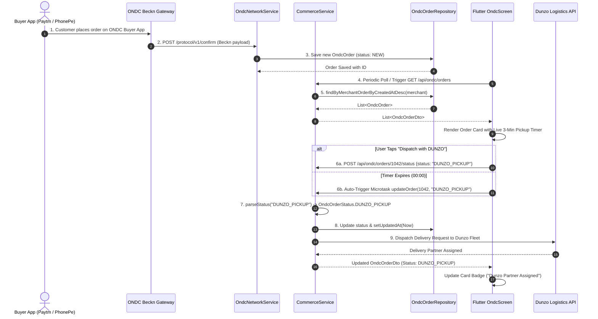
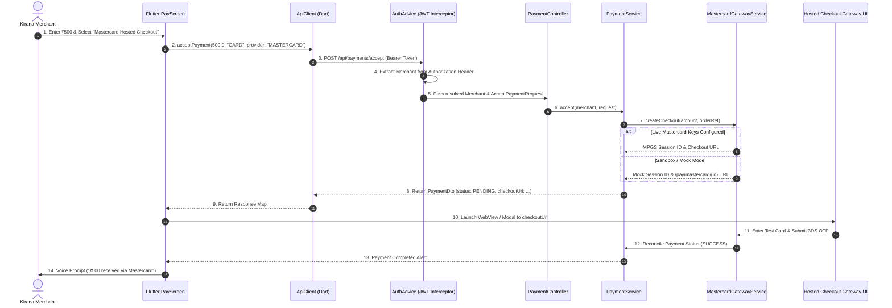

# FinTap End-to-End System Project Flow Specification

This specification breaks down the end-to-end operational flow of **FinTap**, detailing how data moves seamlessly from the **Flutter Client UI**, through the **Spring Boot REST Controllers & Middleware**, into the **Core Domain Logic & JPA Persistence**, and out to **External Protocol Engines (ONDC, Mastercard MPGS, Dunzo)**.

---

## 1. Architectural Layer Breakdown

FinTap is constructed using a strict 5-Tier Layered Architecture:

```
┌────────────────────────────────────────────────────────────────────────┐
│ 1. FRONTEND PRESENTATION LAYER (Flutter 3.x Mobile & Web)              │
│    Screens (Pay, ONDC, Khata, Insights) -> ApiClient HTTP Client        │
└───────────────────────────────────┬────────────────────────────────────┘
                                    │ HTTP REST / Bearer JWT
┌───────────────────────────────────▼────────────────────────────────────┐
│ 2. CONTROLLER & GATEWAY LAYER (Spring Boot REST Controllers)           │
│    AuthAdvice (JWT Auth) -> CommerceController, PaymentController      │
└───────────────────────────────────┬────────────────────────────────────┘
                                    │ Injected Beans & DTO Objects
┌───────────────────────────────────▼────────────────────────────────────┐
│ 3. BUSINESS LOGIC & SERVICE LAYER (Spring @Service Beans)              │
│    CommerceService, PaymentService, OndcNetworkService, Mastercard     │
└───────────────────────────────────┬────────────────────────────────────┘
                                    │ Spring Data JPA Methods
┌───────────────────────────────────▼────────────────────────────────────┐
│ 4. PERSISTENCE & DATA LAYER (JPA Repositories & H2 Database)           │
│    MerchantRepository, OndcOrderRepository, PaymentRepository          │
└───────────────────────────────────┬────────────────────────────────────┘
                                    │ Network Protocols & REST
┌───────────────────────────────────▼────────────────────────────────────┐
│ 5. EXTERNAL PROTOCOL & LOGISTICS INTEGRATIONS                          │
│    ONDC Beckn Registry, Mastercard MPGS Gateway, Dunzo Delivery Fleet   │
└────────────────────────────────────────────────────────────────────────┘
```

---

## 2. Comprehensive End-to-End Data Flow Sequences

### Flow A: ONDC Order Reception & Automated Dunzo Dispatch



---

### Flow B: Mastercard Hosted Checkout (MPGS) Payment Processing



---

## 3. Data Transformation Pipeline

Data transitions across layers using strict Type Mappings:

```
[Flutter JSON Map]  <--->  [Spring DTO Record]  <--->  [JPA Entity Domain]  <--->  [SQL Database Row]
 {                          record OndcOrderDto(         @Entity                   ONDC_ORDERS Table
   "id": 1042,                Long id,                   public class OndcOrder {   ID BIGINT PRIMARY KEY,
   "orderRef": "ONDC-4418",   String orderRef,             private Long id;         ORDER_REF VARCHAR(64),
   "amount": "281.00",        BigDecimal amount,           private BigDecimal amt;  AMOUNT DECIMAL(10,2),
   "status": "ACCEPTED"       OndcOrderStatus status       private Enum status;     STATUS VARCHAR(32)
 }                          )                            }                         }
```

---

## 4. Key Security & Resilience Controls

1. **Authentication Token Lifecycle**:
   - Flutter stores token in `SharedPreferences`.
   - Included in HTTP headers: `Authorization: Bearer <jwt-token>`.
   - Injected into Spring Controllers seamlessly by [`AuthAdvice.java`](file:///e:/GIRI/Workspaces/FinTap/backend/src/main/java/com/fintap/digikadai/web/AuthAdvice.java).

2. **Fault-Tolerant Status Parsing**:
   - `CommerceService.parseStatus()` normalizes raw string inputs (case-insensitive, whitespace-trimmed) to prevent `IllegalArgumentException` and 500 errors.

3. **Global Exception Containment**:
   - [`ApiExceptionHandler.java`](file:///e:/GIRI/Workspaces/FinTap/backend/src/main/java/com/fintap/digikadai/web/ApiExceptionHandler.java) intercepts `ResponseStatusException`, `IllegalArgumentException`, and uncaught errors, standardizing HTTP error payloads as `{ "error": "<clean_reason>" }`.
